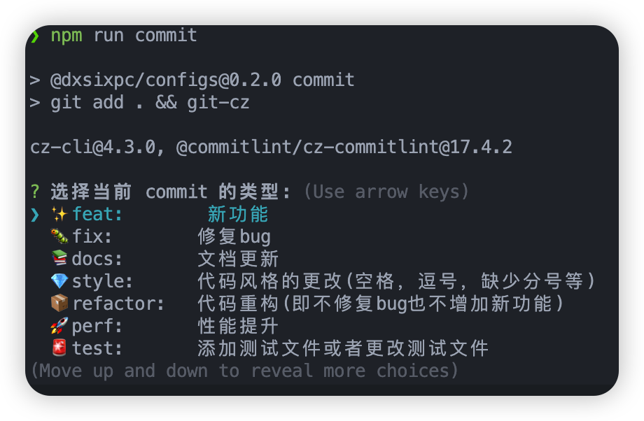

# @dxsixpc/configs

[](https://www.npmjs.com/package/@dxsixpc/configs)
[](https://www.npmjs.com/package/@dxsixpc/configs)

# 简介

## 配置库

> 分享一些项目通用配置


## 安装

```sh
npm install --save-dev @dxsixpc/configs
```


## 使用

### commitlint

`package.json`

```json
"scripts": {
  "commit": "git add . && git-cz",
},
"config": {
  "commitizen": {
    "path": "@commitlint/cz-commitlint"
  }
},
```

`commitlint.config.js`

```js
module.exports = {
  extends: ['@dxsixpc/configs/commitlint-config'],
};
```

上述文件设置好后，提交代码时使用下列命令

```shell
npm run commit
```




### eslint

`.eslintrc.js`

```js
module.exports = {
    extends: require.resolve("@dxsixpc/configs/eslint-config")
};
```


### prettier

`.prettierrc`

```js
'@dxsixpc/configs/prettier-config';
```

`.prettierrc.js`

```js
module.exports = {
  ...require("@dxsixpc/configs/prettier-config"),
};
```


### rollup

`rollup.config.mjs`

```js
import config from '@dxsix/configs/rollup-config/index.js';

export default config({
  output: [
    {
      dir: 'dist',
      format: 'cjs',
      sourcemap: true
    },
  ]
});
```


### stylelint

`.stylelintrc`

```json
{
  "extends": "@dxsixpc/configs/stylelint-config"
}
```


### tsconfig

`tsconfig.json`

```json
{
  "extends": "@dxsixpc/configs/tsconfig",
}
```


## License

MIT © [dxsixpc](https://github.com/dxsixpc)

